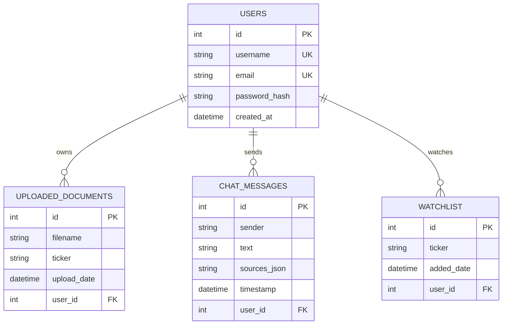

# Market Intelligence & Corporate Analysis Dashboard

A modern, wowed-design web application for real-time market intelligence analytics and source-backed RAG AI chat analysis.

---

## Project Structure
- `/client`: React (Vite + TypeScript) frontend visual dashboard.
- `/server`: Flask (Python 3) JWT authentication, tickers database, and ChromaDB vector store.

---

## Complete Features Guide

### 1. User Authentication & Multi-User Isolation
- **Secure Registration / Login**: Backed by JWT-secured sessions. Stateless HS256 tokens are signed using a backend `SECRET_KEY` and persisted in `localStorage`.
- **Hashed Passwords**: Hashed on the backend using `Flask-Bcrypt`.
- **Protected Routes**: Protected endpoints use a `@token_required` decorator to fetch the current user profile.
- **RAG Multi-User Isolation**: Vector store index searches in ChromaDB are strictly isolated per user using `user_id` metadata filters, ensuring users can never query or view other users' uploaded report contexts.

### 2. Document CRUD Management (User-Owned Resource)
- **Create**: Drag-and-drop or select corporate report PDFs in the sidebar. The backend parses pages using `pypdf`, chunks text, generates embeddings, and indexes them into ChromaDB.
- **Read**: List of all uploaded reports displayed dynamically in the sidebar.
- **Update**: Click the `✏️` button next to any report's ticker metadata in the sidebar to change the ticker symbol it is mapped to.
- **Delete**: Click the `✕` delete button next to any report in the sidebar. This removes the SQLite document entry, deletes the physical file from the server's filesystem, and purges its vector embeddings from ChromaDB.

### 3. Persistent AI-Related Chat
- **RAG Assistant**: Natural language Q&A chatbot that retrieves relevant chunks from the user's isolated documents and generates source-cited responses via the Gemini API (using the hash fallback embedding function if rate-limited).
- **Citations**: Source badges are displayed in chat bubbles showing the filename and page number.
- **Chat Persistence**: Conversations are saved to SQLite and automatically reloaded on login.
- **Clear Chat**: Click "Clear Chat" in the sidebar to purge past conversation records from SQLite.

### 4. Interactive Watchlist Widget
- **Star Tickers**: Click the `★` star icon in any chart header to quickly add that symbol to your watchlist.
- **Add manually**: Enter a ticker symbol in the sidebar's Watchlist form.
- **Interactive Syncing**: Click any watchlisted symbol in the sidebar to instantly load its live historical chart data on Chart A.

---

## Relational SQLite Data Models



---

## Presentation Startup Guide

To present the app, follow these simple steps to launch the servers:

### 1. Start the Flask Backend Server
Open your terminal, navigate to the `server/` directory, and run the following commands:
```bash
# 1. Navigate to the server folder
cd server

# 2. Activate the python virtual environment
source .venv/bin/activate

# 3. Start the Flask server
python app.py
```
*Note: Make sure your `server/.env` file contains your `GEMINI_API_KEY` (which is already configured).*

### 2. Start the Vite React Frontend
Open a second terminal window, navigate to the `client/` directory, and run:
```bash
# 1. Navigate to the client folder
cd client

# 2. Run the Vite development server
npm run dev
```

### 3. Open the Application
Once both servers are running, open your web browser and go to:
👉 **[http://localhost:5173/](http://localhost:5173/)**

Log in using your account (or register a new one) to present the interactive charts, watchlist, document CRUD manager, and RAG assistant!
